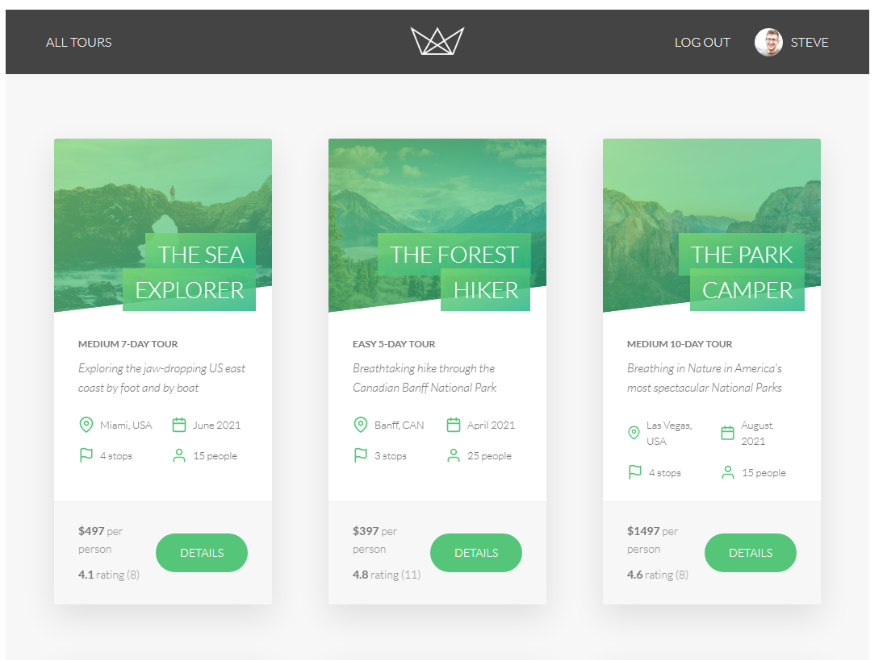
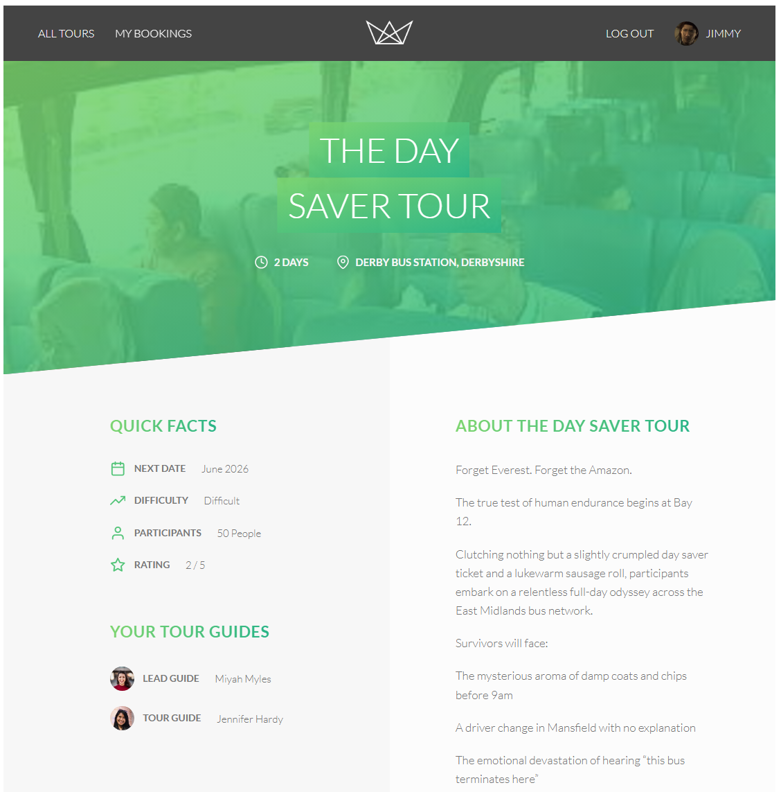
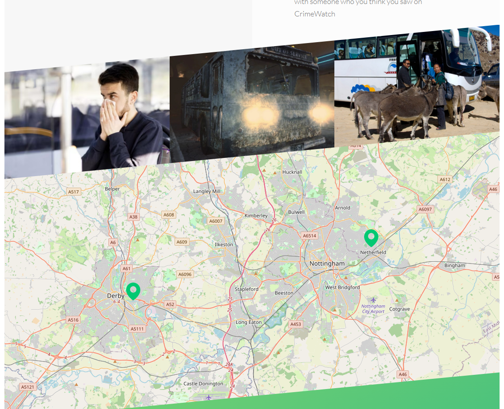
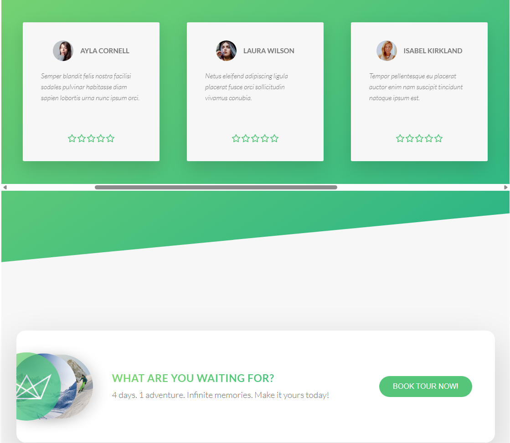
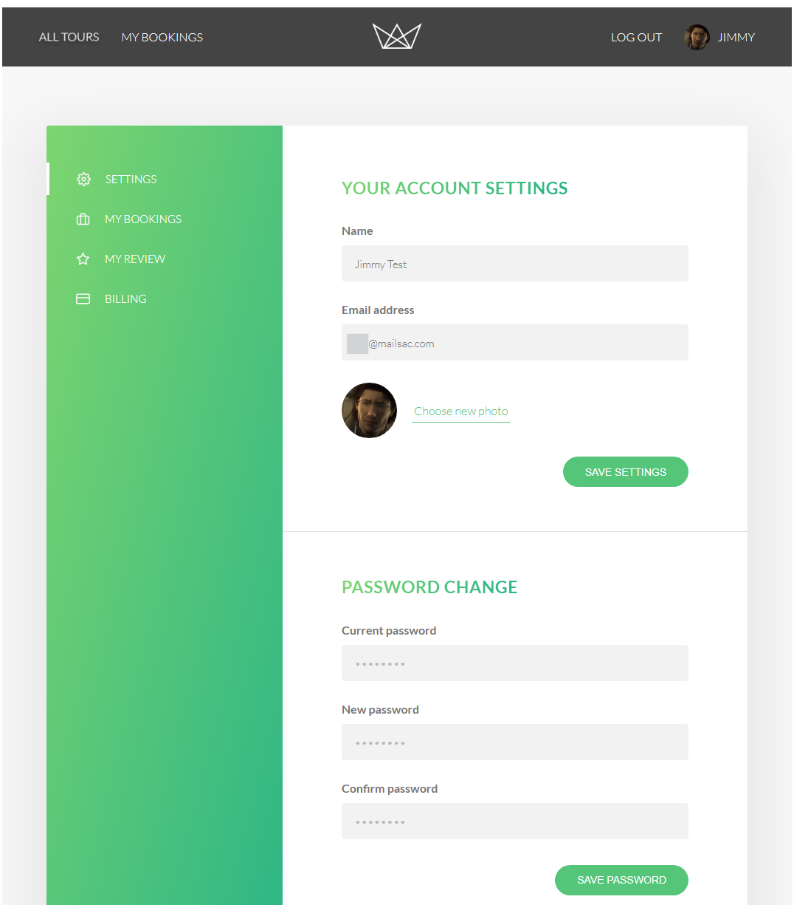

# Natours


A full-stack tour booking application built with Node.js, Express, MongoDB, and Stripe.

Users can browse tours, explore locations on interactive maps, book experiences securely, and manage their accounts through a complete authentication system.

## Live Demo
https://natours-upou.onrender.com/

## Preview

## Homepage


### Tour Details
<p align="center">
  
  
  
</p>

### User Dashboard



## Features

- Secure user authentication & authorization
- JWT-based login system
- Tour booking with Stripe Checkout
- Interactive tour maps with Leaflet + OpenStreetMap
- User reviews and ratings
- RESTful API architecture
- MongoDB aggregation pipelines
- Server-side rendering with Pug templates
- Image upload and processing with Sharp
- Secure production-ready middleware configuration

## Tech Stack

### Backend
- Node.js
- Express.js
- MongoDB
- Mongoose

### Frontend
- Pug
- Vanilla JavaScript
- Leaflet

### Payments
- Stripe Checkout

### Security
- Helmet
- express-rate-limit
- mongo-sanitize
- xss-clean

### Deployment
- Render

## API Testing & Documentation

A public Postman collection is available for exploring and testing the Natours REST API.

The workspace documents:
- Authentication & authorization
- Tour management endpoints
- Review and booking routes
- Nested route examples
- Geospatial querying
- Stripe checkout session flows

JWT authentication is handled automatically through Postman environment variables for easier testing.

🔗 Postman Collection: https://www.postman.com/foxnineone-376599/natours

## Application Architecture

The project follows an MVC architecture:

- Models handle MongoDB data structures
- Controllers manage application logic
- Routes define API endpoints
- Views are rendered server-side using Pug

Authentication uses JWT tokens stored in secure HTTP-only cookies.

## Installation

Clone the repository:

```bash
git clone https://github.com/FoxNineOne/Natours.git
```

Navigate into the project:

```bash
cd natours
```

Install dependencies:

```bash
npm install
```

Create a `config.env` file in the root directory (you can follow the example (config_env.example))


Start the development server:

```bash
npm run start:dev
```


## Available Scripts

```bash
npm run start:dev   # Development mode
npm run debug       # Debug mode
npm run prod        # Production mode
```


## Engineering Challenges

### Migrating from Mapbox to Leaflet

The original project implementation used Mapbox, which now requires payment setup for API access.

To keep the project fully accessible, the mapping system was migrated to Leaflet with OpenStreetMap tiles.

This required:
- Rewriting map rendering logic
- Resolving CSP conflicts
- Adjusting frontend asset loading
- Handling Leaflet's global `L` object integration

### Stripe Integration

Implemented Stripe Checkout sessions and secure webhook handling for booking confirmation.

Additional work included:
- Dynamic production callback URLs
- Secure webhook verification
- Handling deployment-specific environment variables

### Deployment Differences

The original course targeted Heroku deployment. This project was adapted for Render, which required changes to:
- Environment configuration
- HTTPS handling
- Process lifecycle management
- SIGTERM shutdown handling

## Security Features

- Rate limiting
- NoSQL injection protection
- XSS sanitization
- Secure HTTP headers with Helmet
- Password hashing with bcrypt
- JWT authentication

## Lessons Learned

Building and adapting this project helped reinforce:

- MVC architecture principles
- REST API design
- MongoDB aggregation pipelines
- Authentication and authorization flows
- Payment processing integration
- Production deployment troubleshooting
- Security best practices
- Debugging third-party dependency changes

## Acknowledgements

Originally based on the Node.js Bootcamp course by Jonas Schmedtmann, with significant modifications and updates to modernize deployment and mapping integrations.

## Known Limitations

- Review posting is currently unrestricted to booked users
- Admin management functionality is API-only
- Password reset flow currently relies on API endpoints

## Additional Enhancements
- Amended the protect middleware to not show an error message when logging out from the "My Account" page
- Integrated the tinyFox.dev API to display random animal imagery on application error pages
- Updated payment page branding colours for improved accessibility
- Added a "My Bookings" shortcut to the main navigation for improved accessibility

## Future Improvements
- Implement a sign up form page
- Add a "forgotten password" form on the website to provide alternative to the API "password reset" token request 
- Add a restriction that users can only review a tour they have actually booked.
- Follow up the above with an on site form to fill in reviews, as an alternative to the API post.
- Hide tours from user on the tours page, if the user already has specific tours booked
- Implement the "My Reviews" page to render posted reviews for a user.
- Follow up the above to edit reviews and resubmit.
- Allow Admins to manage tours, users, reviews and bookings via the front end
- Modernising the MongoDB driver connection ahead of planned deprecation changes

## Project Background

Natours began as part of an advanced Node.js course project and was later expanded independently to modernize integrations, deployment, and overall maintainability.

Several third-party services and deployment assumptions from the original course material had changed over time, requiring significant adaptation and debugging work to keep the application production-ready.

## Project Structure

```text
controllers/
models/
routes/
views/
public/
utils/
dev-data/
